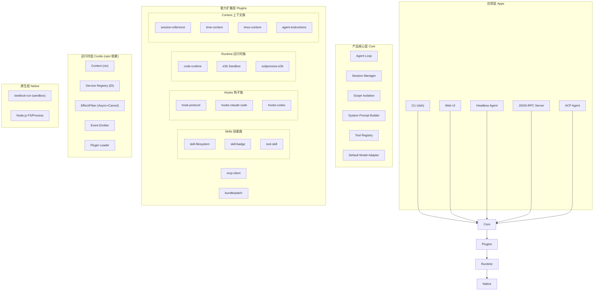
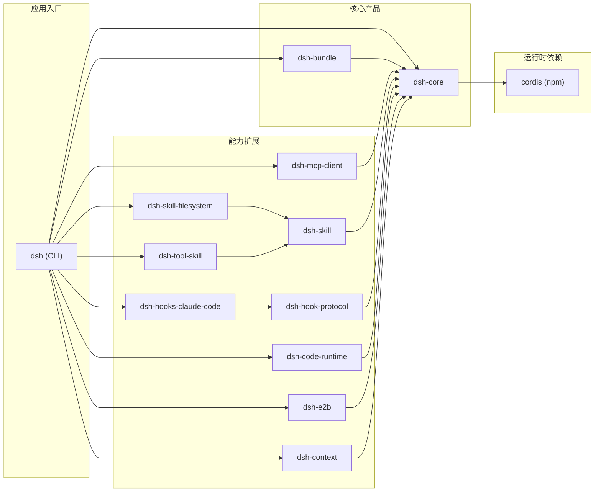
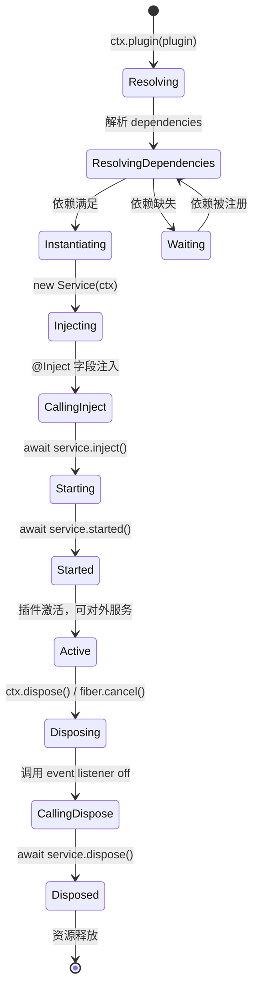
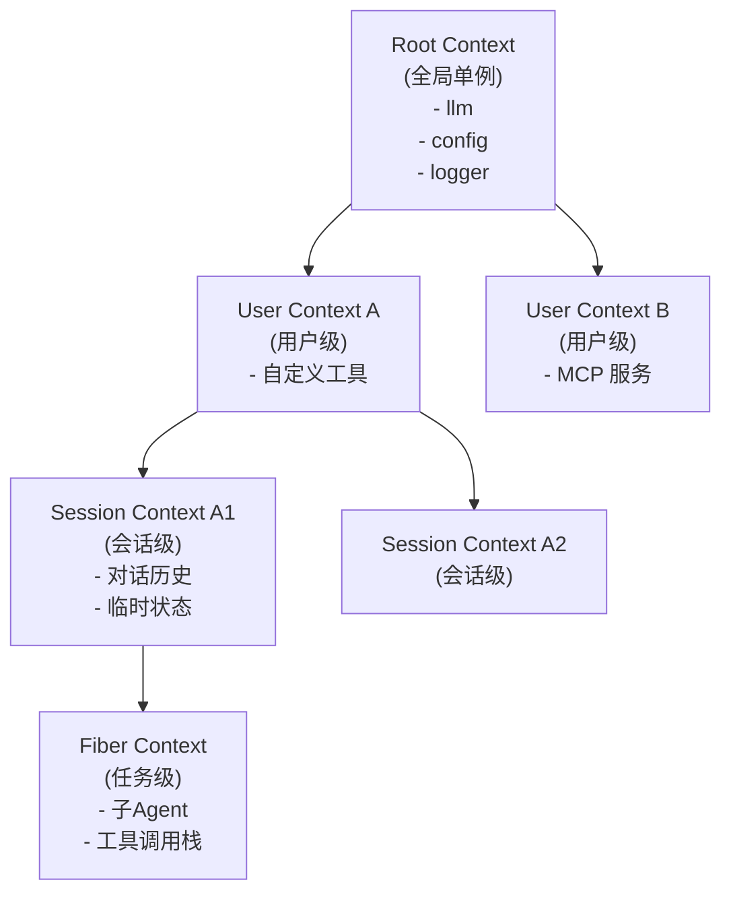
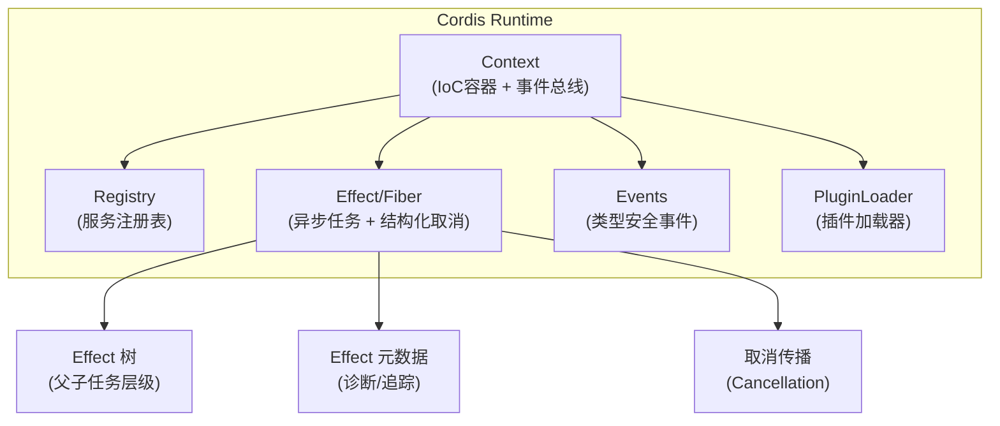
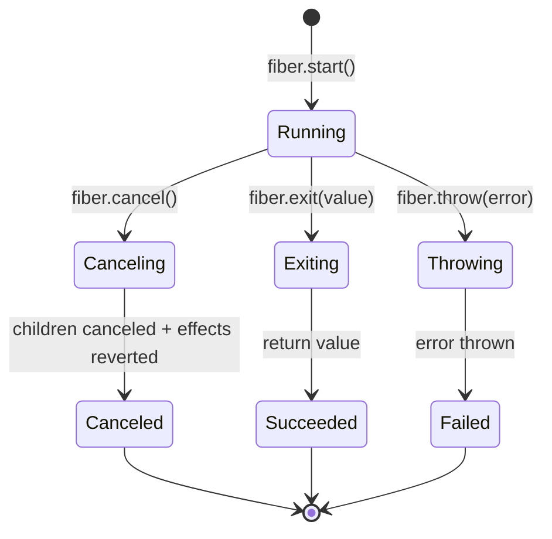
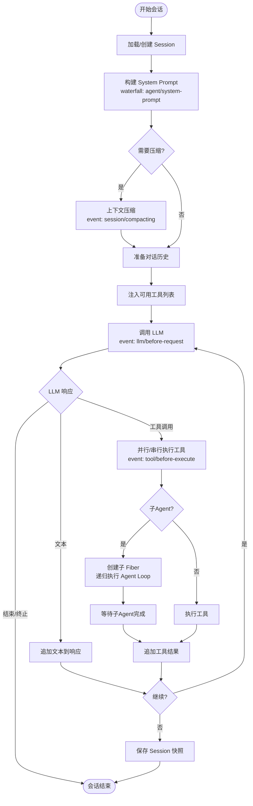
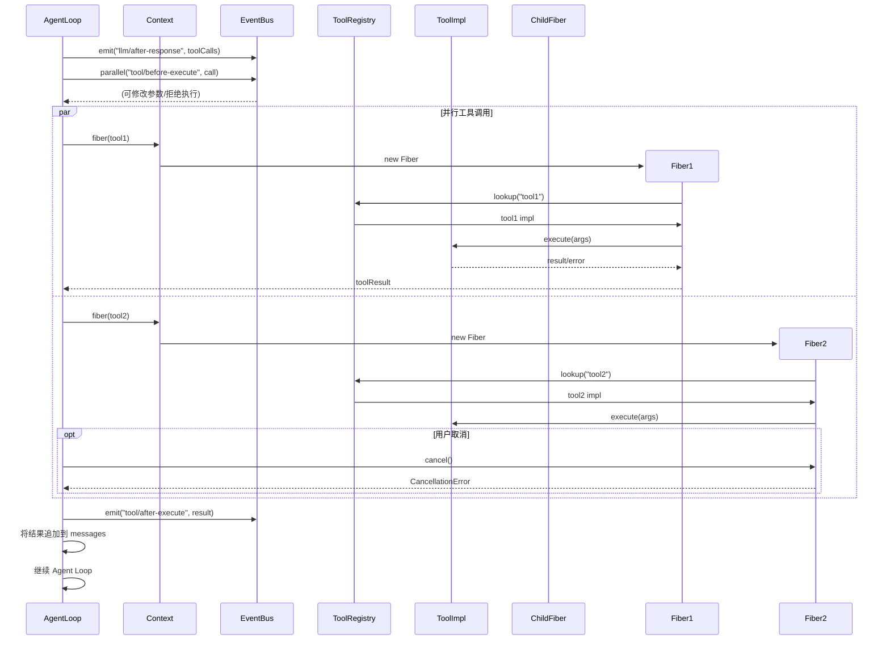
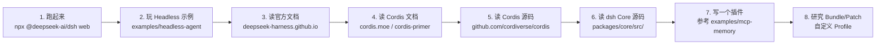

# DeepSeek Harness 架构深度分析

> **作者**: 架构分析师
> **日期**: 2026-08-14
> **版本**: v2.0（修订版）
> **读者**: 工程师/架构师
> **仓库**: https://github.com/deepseek-ai/deepseek-harness
> **官网**: https://deepseek.com/harness/en/
> **开发文档**: https://deepseek-harness.github.io/deepseek-harness/en/guide/quickstart
> **Cordis 仓库**: https://github.com/cordiverse/cordis

---

## 版本说明

- **DeepSeek Harness 版本**: 0.1.0-rc.5（developer preview）
- **项目状态**: 开发者预览阶段，官方明确声明"THERE WILL BE COMPATIBILITY-BREAKING CHANGES"
- **许可证**: MIT
- **GitHub Stars**: 36.9k（截至 2026-08-14）
- **本文代码示例**: 基于仓库文档和 Cordis API 文档整理，部分 API 签名为推断，已标注。Cordis 官方声明 API 尚未稳定，使用前请核对最新源码。

---

## 目录

1. [项目概览](#1-项目概览)
2. [整体架构](#2-整体架构)
3. [插件机制深度解析："一切皆插件"](#3-插件机制深度解析一切皆插件)
4. [核心运行时：Cordis](#4-核心运行时cordis)
5. [状态流转与执行模型](#5-状态流转与执行模型)
6. [底层机制价值评估](#6-底层机制价值评估)
7. [内置插件与推荐清单](#7-内置插件与推荐清单)
8. [总结与建议](#8-总结与建议)

---

## 1. 项目概览

### 1.1 项目定位

**DeepSeek Harness**（简称 `dsh`）是 DeepSeek AI 推出的开源 Agent 框架/工具包，其核心口号是 **"Everything is a Plugin"（一切皆插件）**。项目于 2026-08-13 正式进入 developer preview。

- **语言**: TypeScript-first
- **架构模式**: 微内核 + 插件化
- **核心运行时**: [Cordis](https://github.com/cordiverse/cordis) — 一个独立的开源元框架（Meta-Framework），非 DeepSeek 自研，dsh 以 "powered by Cordis" 的方式使用它
- **交付形态**: Web UI / Headless CLI / JSON-RPC / ACP 多接口
- **包管理**: Monorepo（pnpm workspace），npm scope `@deepseek-ai/dsh-*`
- **Node.js 要求**: 22.19+ 或 24+

### 1.2 设计哲学：三大支柱

DeepSeek Harness 官方产品页提出三大设计支柱：

#### 支柱一：Everything is a plugin（一切皆插件）

> Every capability is a plugin that can be swapped or recomposed: models, tools, skills, sessions, sandboxes, storage, loops, scheduling, and the UI.

基于 Cordis 的插件系统，所有 Agent 能力——模型、工具、技能、会话、沙箱、存储、循环、调度、UI——全部以插件形式存在，可在配置层选择、替换或扩展，无需修改 dsh 源码。

#### 支柱二：Every run is traceable（每次运行可追溯）

> Everything the model sees is recorded in an append-only session log: system prompts, reasoning, tool calls and results, subagent scheduling, and every context injection.

模型可见的一切内容都记录在 **append-only 的 session log** 中：系统提示词、推理过程、工具调用及结果、子 Agent 调度、每次上下文注入。Trajectory 视图可按来源检视这些记录。Resume（恢复）、Fork（分叉）、Search（搜索）、Replay（回放）均操作同一事件流。

#### 支柱三：Multiple runtime modes（多运行时模式）

| 模式 | 工具集 | 场景 |
|------|--------|------|
| **Standard** | 完整工具集（文件编辑、shell、搜索、技能、规划、目标、子Agent、工作流） | 日常使用，功能最全 |
| **Code** | Standard 全部能力 + Code Mode SDK | 模型生成 TypeScript 代码编排多轮工具调用 |
| **Minimal** | 仅 shell + str_replace_editor | 模型基准测试，最小化环境噪声 |
| **Creator** | Standard 全部能力 + 运行时检查 + 插件实验 | 检查当前运行时、内存中测试 Cordis 插件、组合新模式 |

### 1.3 Agent = Model + Harness

官方提出的核心等式：

> **Agent = Model + Harness**

Model 是 Agent 的"灵魂"——提供推理能力。Harness 让 Agent 能理解环境、使用工具、在真实环境中持续工作。dsh 的定位正是这个 Harness 层。

### 1.4 理论基础

Cordis 的设计基于论文 [*A Programming Paradigm for Spatiotemporal Composability*](https://github.com/cordiverse/paper)（时空可组合性编程范式）。该论文定义了两个正交维度：

1. **时间可组合性（Temporal Composability）**: 组件被移除时，其副作用可完全回滚
2. **空间可组合性（Spatial Composability）**: 组件间可声明并响应式管理依赖关系

论文将经典的 effect 和 coeffect 概念提升为运行时机制：revertible effects（可回滚副作用）和 reactive coeffects（响应式协作用）。Cordis 是该论文的参考实现。

### 1.5 与同类框架的差异化定位

> **注意**：以下对比由笔者整理，非官方数据。部分维度因产品形态差异较大，对比仅供参考。

| 维度 | DeepSeek Harness | LangChain | LlamaIndex | AutoGPT |
|------|------------------|-----------|------------|---------|
| **核心抽象** | Plugin/Service | Chain/Agent | Index/Query | Agent |
| **异步模型** | Cordis Effect/Fiber | Promise/async | Promise/async | Promise/async |
| **插件粒度** | 全栈统一（含运行时） | Tool/LLM/Retriever | Tool/Reader | Tool |
| **状态管理** | Append-only Session Log | Memory 接口 | 内存/向量库 | 工作记忆 |
| **可扩展性边界** | 可替换核心运行时 | 链式组合 | 数据层为主 | 任务层 |
| **交付形态** | UI+CLI+RPC+SDK | SDK | SDK | CLI/UI |
| **可追溯性** | 内建 Trajectory 视图 | 需自行实现 | 需自行实现 | 有限 |

---

## 2. 整体架构

### 2.1 分层架构图



### 2.2 核心目录结构

> **注意**：以下目录结构基于浏览器代理对仓库的浏览整理。Cordis 是作为 npm 依赖引入的（`@cordisjs/core` 等），而非 vendored 源码。实际包结构请以仓库为准。

```
deepseek-harness/
├── apps/
│   └── cli/                    # CLI 入口 (dsh 命令)
├── packages/
│   ├── core/                   # 产品核心 (Agent Loop/Session/Tools)
│   │   ├── src/
│   │   │   ├── agent-loop/     # Agent 主循环
│   │   │   ├── session/        # 会话管理与快照
│   │   │   ├── scope/          # 作用域隔离
│   │   │   ├── tools/          # 工具注册中心
│   │   │   ├── system-prompt/  # 系统提示词构建
│   │   │   └── agent-default-model/
│   ├── mcp/                    # MCP 协议客户端
│   ├── skill/                  # Skill 核心抽象
│   │   ├── skill-filesystem/   # 文件系统技能
│   │   ├── skill-badge/        # 能力徽章声明
│   │   └── tool-skill/         # Tool→Skill 适配器
│   ├── hooks/                  # Hook 协议与桥接
│   │   ├── hook-protocol/      # Hook 协议定义
│   │   ├── hooks-claude-code/  # Claude Code CLI 桥接
│   │   └── hooks-codex/        # OpenAI Codex CLI 桥接
│   ├── code-runtime/           # 代码执行运行时
│   ├── e2b/                    # E2B 沙箱集成
│   ├── context/                # 上下文扩展包
│   └── bundle/                 # Bundle/Patch 打包机制
├── native/
│   └── landlock-run/           # Landlock 沙箱启动器
├── examples/                   # 示例项目
│   ├── headless-agent/         # 无头 Agent 示例
│   ├── mcp-memory/             # MCP 记忆插件示例
│   ├── web-schedule/           # 调度示例
│   ├── acp-agent/              # ACP 协议示例
│   └── jsonrpc-agent/          # JSON-RPC 示例
└── docs/
    ├── architecture.md         # 架构文档
    ├── development.md          # 开发指南
    └── cordis-api/             # Cordis API 文档
        ├── context.md
        ├── service.md
        ├── events.md
        ├── fiber.md
        └── registry.md
```

**Cordis 源码** 位于独立仓库 [github.com/cordiverse/cordis](https://github.com/cordiverse/cordis) 的 `packages/` 目录下，通过 npm 依赖引入 dsh。

### 2.3 Monorepo 包依赖关系



> **注意**：以上包名和依赖关系基于浏览器代理对仓库的浏览整理，实际包名和依赖请以 `packages/` 下各 `package.json` 为准。

---

## 3. 插件机制深度解析："一切皆插件"

### 3.1 核心理念

在 DeepSeek Harness 中，**所有扩展点甚至核心组件都以插件形式存在**：

- ✅ LLM 适配器 → 插件
- ✅ Tool/Skill/MCP 工具 → 插件
- ✅ Hook 拦截器 → 插件
- ✅ 上下文提供者 → 插件
- ✅ 代码运行时 → 插件
- ✅ 会话存储 → 插件
- ✅ UI 组件 → 插件（逻辑层）
- ✅ Agent 本身 → 插件

### 3.2 插件的三种入口形态

> **注意**：以下代码示例基于 Cordis API 文档和仓库源码结构整理。Cordis 官方声明 "The API is not yet stable and may change without notice"。使用前请核对 [Cordis 最新源码](https://github.com/cordiverse/cordis)。

Cordis 支持三种插件注册方式，适应不同复杂度场景：

#### 形态一：函数式插件（Simple Effect）

适用于简单扩展、事件监听、一次性初始化：

```typescript
// 函数式插件：接收 ctx，返回 disposer 函数
export default function (ctx: Context, config: MyPluginConfig) {
    // 1. 注册事件监听
    ctx.on('llm/before-request', (event) => {
        console.log('LLM 请求:', event.prompt);
    });

    // 2. 注册工具
    ctx.tools.register({
        name: 'my-tool',
        description: '我的自定义工具',
        async execute(input) {
            return { result: 'hello' };
        }
    });

    // 3. 返回清理函数（插件卸载时调用）
    return () => {
        console.log('插件已卸载');
    };
}
```

#### 形态二：类式插件（Service 继承）

适用于有状态服务、依赖注入、生命周期管理：

```typescript
import { Service, Provide, Inject } from 'cordis';

// 声明可注入的服务标识
export const MyService = Service.create('my-service');

@Provide(MyService)
export class MyServiceImpl extends Service {
    // 依赖注入：自动解析其他服务
    @Inject()
    protected logger!: Logger;

    @Inject('llm')
    protected llm!: LLMService;

    constructor(ctx: Context) {
        super(ctx);
        // 构造函数：只做基础初始化，不要访问注入的依赖
    }

    // inject 阶段：依赖已注入，可进行配置
    protected async inject() {
        this.logger.info('MyService 依赖注入完成');
    }

    // started 阶段：服务正式启动
    protected async started() {
        this.logger.info('MyService 已启动');
        // 可在此启动定时器、连接资源等
    }

    // 业务方法
    public async doSomething(input: string) {
        return this.llm.complete(input);
    }

    // dispose 阶段：资源清理
    protected async dispose() {
        this.logger.info('MyService 已停止');
    }
}
```

> **注意**：`@Provide` / `@Inject` 装饰器的具体签名和可选注入语义（`optional` 参数等）请以 Cordis 源码为准。2026-05-12 的 commit "feat(core): remove optional inject semantics" 表明 API 在变动中。

#### 形态三：对象式插件（Plugin Manifest）

适用于复杂插件包、多服务注册、子插件组合：

```typescript
// 对象式插件：声明依赖、配置、多个服务和子插件
// 注意：此结构为基于 Cordis 文档的推断，具体字段请以源码为准
export default {
    name: 'my-complex-plugin',
    dependencies: ['llm', 'fs'],
    optionalDependencies: ['e2b'],

    // 默认配置
    config: {
        maxRetries: 3,
        timeout: 30000,
    },

    // 服务提供
    provides: {
        'my-service': MyServiceImpl,
        'my-other-service': MyOtherServiceImpl,
    },

    // 子插件（组合）
    plugins: [
        import('./sub-plugin-a'),
        import('./sub-plugin-b'),
    ],

    // 插件主逻辑
    async apply(ctx: Context, config) {
        // 启动逻辑
        ctx.on('session/started', (session) => {
            // ...
        });
    },
};
```

### 3.3 插件加载生命周期



**生命周期各阶段说明**：

| 阶段 | 触发时机 | 可访问依赖 | 典型操作 |
|------|----------|------------|----------|
| **constructor** | 实例化时 | ❌ 不可用 | 字段初始化、配置校验 |
| **inject** | 依赖注入完成后 | ✅ 可用 | 配置初始化、事件监听注册 |
| **started** | 所有服务启动后 | ✅ 可用 | 启动后台任务、连接外部资源 |
| **active** | 运行中 | ✅ 可用 | 正常提供服务 |
| **dispose** | 卸载/Fiber取消时 | ✅ 可用（清理阶段） | 资源释放、任务取消、连接关闭 |

> **注意**：Cordis 论文中将 constructor→inject→started→dispose 描述为"revertible effects"（可回滚副作用）的实现：每个阶段注册的 effect 在 dispose 时自动执行其 inverse。以上阶段命名基于 Cordis 文档整理，具体方法名请以源码为准。

### 3.4 依赖注入（DI）机制

> **注意**：以下 API 基于 Cordis 文档整理，具体方法签名请核对 [Cordis 源码](https://github.com/cordiverse/cordis)。

```typescript
// 1. 提供服务
ctx.provide('my-service', MyServiceImpl);

// 2. 注入服务（命令式）
const myService = await ctx.inject('my-service');

// 3. 装饰器注入（声明式）
class MyService extends Service {
    @Inject()
    protected llm!: LLMService;          // 按类型注入

    @Inject('fs')
    protected fs!: FileSystemService;    // 按名称注入

    // 注意：optional inject 语义已于 2026-05-12 被移除
    // 参见 commit: feat(core): remove optional inject semantics
}

// 4. 服务作用域
ctx.isolate('session', (sessionCtx) => {
    // sessionCtx 有独立的服务实例
    sessionCtx.provide('session-cache', SessionCache);
});
```

### 3.5 服务作用域与隔离（Scope）

Cordis 支持多层级的 Context 树，实现"空间可组合性"：



**作用域特性**（基于 Cordis 论文中"reactive coeffects"概念）：
- **isolate()**: 创建独立作用域，服务可以在该作用域被替换/覆盖
- **extend()**: 继承父作用域所有服务，可新增
- **intercept()**: 拦截服务访问，实现 AOP

> **注意**：以上方法名为基于 Cordis 文档的整理，具体 API 请核对源码。

### 3.6 配置系统：Profile + Bundle

DeepSeek Harness 通过 **Profile** 和 **Bundle** 实现部署态组合。官方将这套机制类比为"加载 Linux 内核模块而非重新编译内核"。

#### 概念层次

| 概念 | 角色 | 类比 |
|------|------|------|
| **Plugin** | 代码模块，注册 service/tool/event | 家具本身 |
| **Bundle** | 可分发的配置层，带 patch 文件 | 家具清单和摆放方案 |
| **Profile** | 可启动的命名组合 | 你的房子 |
| **Patch** | 覆盖或插入配置 row 的层 | 后来把书桌换位置的决定 |

> 启动的是 Profile（房子），实际出现什么由所有层合成。

#### Profile（部署配置）

```yaml
# cordis.yml - Profile 文件示例
# 注意：此为示意结构，实际格式以仓库示例为准
plugins:
  # 核心
  - '@deepseek-ai/dsh-core'
  - '@deepseek-ai/dsh-mcp-client'

  # 技能
  - '@deepseek-ai/dsh-skill-filesystem'
  - '@deepseek-ai/dsh-tool-skill'

  # 钩子
  - '@deepseek-ai/dsh-hooks-claude-code'

  # 运行时
  - '@deepseek-ai/dsh-code-runtime'

config:
  llm:
    model: 'deepseek-chat'
    baseURL: 'https://api.deepseek.com'
  fs:
    root: '/workspace'
```

#### Bundle（可安装插件包）

Bundle 是带有 `dsh.bundle.patch` 声明的 npm 包，可以：
- 声明对现有服务的 patch（修改/增强）
- 组合多个插件为一个可安装单元
- 提供默认配置预设

```json
// 第三方插件包的 package.json（示意）
{
  "name": "dsh-plugin-git",
  "dsh": {
    "bundle": {
      "patches": [
        "./patch-core.js"
      ]
    }
  }
}
```

使用 Profile 启动：
```bash
dsh --profile ./my-profile.yaml web
```

### 3.7 Capability Seam（能力接缝）设计

官方强调的"capability seam"模式是"一切皆插件"的具体落地方式：

> **seam = service definition + Provider implementation + consumer**

例如，将文件系统和子进程 Provider 指向远程沙箱后，Bash、PTY、LSP 等工具会自动跟随——**替换一个 Provider，整个执行环境改变**。这种设计让开发者无需 fork 框架即可替换任意能力。

---

## 4. 核心运行时：Cordis

[Cordis](https://github.com/cordiverse/cordis) 是一个独立的开源元框架（Meta-Framework），由 `cordiverse` 组织维护（主要贡献者 `shigma`、`Chinesezjc`）。deepseek-harness 以 npm 依赖方式使用它。

- **仓库**: https://github.com/cordiverse/cordis
- **文档站**: https://cordis.moe/
- **论文**: [*A Programming Paradigm for Spatiotemporal Composability*](https://github.com/cordiverse/paper)
- **状态**: "The API is not yet stable and may change without notice"
- **语言**: TypeScript 99.9%
- **下游使用**: 340 个项目

### 4.1 Cordis 核心组件



### 4.2 Effect 系统：可回滚副作用

Cordis 论文的核心创新是 **revertible effects（可回滚副作用）**：

> 每个上下文变换都携带一个 inverse（逆操作），运行时自动追踪。

这意味着：插件注册的每个副作用（事件监听、定时器、资源句柄等）在插件卸载时自动回滚。这是"时间可组合性"的实现基础。

```typescript
// Effect 基本用法（基于 Cordis 文档整理，API 可能变动）
// ctx.effect() 注册一个副作用，返回清理函数
ctx.effect(() => {
    const timer = setInterval(() => doWork(), 1000);
    return () => clearInterval(timer);  // 自动在 Fiber 取消时调用
});

// Fiber：结构化异步任务（基于文档推断，具体 API 请核对源码）
const fiber = ctx.fiber(async (childCtx) => {
    // childCtx 是子 Fiber 的上下文
    // 当父 Fiber 取消时，此任务会自动取消

    const result = await childCtx.llm.complete(prompt);
    return result;
});

// 取消 Fiber（级联取消所有子任务）
fiber.cancel();
```

**Fiber 状态机**（基于 Cordis 文档整理）：



**Effect 追踪**：每个 Fiber 维护 Effect 元数据树，可用于：
- 调试：查看任务调用栈
- 诊断：统计每个工具调用耗时
- 可视化：在 UI 中展示任务执行树

> **注意**：以上 `ctx.fiber()`、`fiber.cancel()`、`fiber.exit()` 等 API 签名为基于 Cordis 文档的推断，具体方法名和参数请核对 [Cordis 源码](https://github.com/cordiverse/cordis)。Cordis 论文描述的是 effect tracking 和 coeffect resolution 机制，具体 API 表达可能有所不同。

### 4.3 事件系统（Events）

> **注意**：以下事件名为基于仓库文档整理的命名空间约定，具体事件名和语义请以 Cordis 源码和 dsh 各包的 `ctx.emit/on` 调用为准。

Cordis 提供类型安全的事件系统，支持多种调用语义：

```typescript
// 事件命名空间约定（基于文档整理，可能有出入）
// agent/*      - Agent 生命周期
// session/*    - 会话事件
// llm/*        - LLM 调用
// tools/*      - 工具注册/调用
// skills/*     - 技能事件
// code-runtime/* - 代码执行
// subagent/*   - 子Agent
// fiber/*      - Fiber 生命周期

// 1. 普通事件（并行触发，不等待）
ctx.emit('llm/request-started', { prompt });

// 2. 并行事件（等待所有监听器完成）
await ctx.parallel('tool/before-execute', { tool, input });

// 3. 串行瀑布流（每个监听器接收前一个的输出）
const finalPrompt = await ctx.waterfall('agent/system-prompt', basePrompt);

// 4. 串行事件（按顺序执行）
await ctx.serial('session/saving', { session });

// 5. 一次性监听
ctx.once('session/started', handler);

// 6. 监听 + Effect 绑定（Fiber 取消时自动移除监听）
ctx.effect(() => {
    const off = ctx.on('llm/after-request', handler);
    return off; // 返回清理函数，自动在 dispose 时调用
});
```

> **注意**：`ctx.parallel()`、`ctx.waterfall()`、`ctx.serial()` 等方法名为基于 Cordis 文档的整理，具体方法名请核对源码。

**已识别的事件命名空间**（基于仓库文档整理，非完整清单）：

| 命名空间 | 语义 |
|----------|------|
| `agent/*` | Agent 生命周期（starting、system-prompt 等） |
| `session/*` | 会话事件（started、saving、compacting 等） |
| `llm/*` | LLM 调用（before-request、after-request 等） |
| `tool/*` / `tools/*` | 工具注册/调用（before-execute、after-execute、error 等） |
| `skills/*` | 技能事件 |
| `code-runtime/*` | 代码执行 |
| `subagent/*` | 子 Agent |
| `fiber/*` | Fiber 生命周期 |

### 4.4 Hooks 与 Events 的区别

| 维度 | Events（事件） | Hooks（钩子/拦截） |
|------|---------------|-------------------|
| **方向** | 发布-订阅（广播） | AOP 拦截（链式） |
| **返回值** | 通常无 | 可修改/替换参数或返回值 |
| **典型用途** | 通知、日志、副作用 | 参数校验、结果转换、短路 |
| **注册方式** | `ctx.on()` | Service 方法覆盖、intercept |
| **生命周期** | 监听器随 Effect 自动清理 | 与 Service 生命周期绑定 |

---

## 5. 状态流转与执行模型

### 5.1 Agent Loop 主流程



### 5.2 会话状态模型：Append-only Session Log

> **官方声明**：Everything the model sees is recorded in an append-only session log.

Session 是 append-only 的事件记录流。用户消息、assistant message、tool/call、tool/result、Turn 边界等关键事实都会被记录。模型下一步看到的 history 是从这些事件投影出来的。

**支持的会话操作**：
- **Resume（恢复）**: 从快照继续会话
- **Fork（分叉）**: 基于同一快照创建多个分支
- **Search（搜索）**: 在事件流中检索
- **Replay（回放）**: 重放事件流
- **Trajectory 视图**: 按来源检视所有记录

**示意数据结构**（非实际类型定义，仅用于说明概念）：

```typescript
// 示意结构，非实际源码类型
interface SessionEvent {
    type: 'message' | 'tool-call' | 'tool-result' | 'turn-boundary' | 'context-injection';
    timestamp: number;
    source: string;       // 来源标识
    data: unknown;        // 事件负载
    // ... 其他字段
}
```

> **注意**：以上接口为概念示意，非来自实际源码。实际的 Session 事件结构请参考 `packages/core/src/session/` 源码。

### 5.3 工具调用执行流



---

## 6. 底层机制价值评估

### 6.1 是否值得研究底层机制？

**结论：值得研究，特别是 Cordis 的 Effect/Coeffect 模型和 dsh 的 capability seam 设计。**

### 6.2 核心价值点分析

#### 价值点 1：Revertible Effects — 可回滚副作用模型

Cordis 论文的核心创新是 revertible effects：每个上下文变换携带一个 inverse，运行时自动追踪。这在 Agent 场景中解决了资源清理问题：

- 用户说"停"时，如何终止正在进行的 LLM 调用、子Agent、代码执行？
- 工具调用超时，如何确保所有子进程、网络连接都被清理？
- 子Agent失败时，如何优雅地回滚而不是留下悬空任务？

传统 `Promise` + `AbortController` 方案的局限：
- 取消信号需要手动传递
- 清理逻辑散落在各处，容易泄漏
- 父子任务关系不明确，取消传播需要手动实现

Cordis 的方案：
- **自动回滚**: Effect 注册时绑定 inverse，卸载时自动执行
- **结构化**: Effect 树保证父子任务层级清晰
- **可观测**: EffectMeta 树可用于调试/可视化

#### 价值点 2：Capability Seam — 能力接缝设计

dsh 的核心设计模式是 "seam = service definition + Provider implementation + consumer"：

> 替换一个 Provider，整个执行环境改变。例如把文件系统和子进程 Provider 指向远程沙箱后，Bash、PTY、LSP 自动跟随。

这种设计让开发者无需 fork 框架即可替换任意能力。相比之下，传统 Agent 框架要替换某个组件通常需要修改核心代码或 fork。

#### 价值点 3：时空可组合性理论

Cordis 背后有正式的学术论文支撑：
- **时间组合**: revertible effects 让异步任务可组合、可取消、可恢复
- **空间组合**: reactive coeffects 让能力可按作用域组合

这一理论视角比"工具调用循环"的抽象层次更高。

#### 价值点 4：Append-only Session Log + Trajectory

官方强调的"Every run is traceable"：
- 模型可见的一切内容都记录在 append-only 事件流中
- Resume/Fork/Search/Replay 均操作同一事件流
- Trajectory 视图可按来源检视

这是 Agent 调试和生产部署的重要能力，在开源 Agent 框架中并不多见。

#### 价值点 5：四种运行时模式

Standard / Code / Minimal / Creator 四种模式覆盖了不同场景：

- **Minimal mode** 专为模型基准测试设计，去除环境噪声
- **Creator mode** 提供"先实验、后固化"的插件开发流程
- **Code mode** 让模型用 TypeScript 编排多轮工具调用

### 6.3 与前沿技术的对应关系

> **注意**：以下对应关系为笔者分析，非官方声明。

| Cordis/dsh 概念 | 对应技术领域 | 类似实现 |
|-----------------|-------------|---------|
| Revertible Effects | 结构化并发 | Kotlin Coroutine、ZIO Effect、Trio (Python) |
| Reactive Coeffects | Algebraic Effects | Koka、Eff |
| Context + Registry | IoC/DI 容器 | VS Code DI、Angular DI |
| Capability Seam | 依赖反转 | OSGi、NixOS Modules |
| Append-only Session Log | 事件溯源 | Event Sourcing、CQRS |
| Profile + Bundle | 模块组合 | NixOS Modules、Linux Kernel Modules |

### 6.4 风险与不足

> **注意**：以下为笔者评估，部分基于官方声明的"developer preview"状态。

1. **API 稳定性**: Cordis 官方明确声明 "The API is not yet stable and may change without notice"。dsh 也声明 "THERE WILL BE COMPATIBILITY-BREAKING CHANGES"
2. **生态初期**: 官方插件数量有限，社区插件通过 `dsh-plugin` GitHub Topic 组织（目前约 43 个仓库）
3. **文档**: Cordis API 文档存在但 API 在快速变动（如 2026-05 移除 optional inject 语义）
4. **学习曲线**: Effect/Coeffect 概念需要适应，不同于传统 Promise 风格
5. **Node.js 绑定**: 目前面向 Node.js 22.19+，浏览器端能力有限

---

## 7. 内置插件与推荐清单

> **注意**：以下插件清单基于浏览器代理对 `packages/` 目录的浏览整理。包名和功能描述未经逐个源码验证。实际包名和可用性请以仓库为准。

### 7.1 核心必备插件

| 插件包 | 功能 | 推荐度 | 说明 |
|--------|------|--------|------|
| `dsh-core` | Agent 核心循环、Session、Tool Registry | ⭐⭐⭐⭐⭐ | 必须，框架核心 |
| `dsh-mcp-client` | MCP (Model Context Protocol) 客户端 | ⭐⭐⭐⭐⭐ | **强烈推荐**，接入所有 MCP 生态工具 |
| `dsh-bundle` | Bundle/Patch 配置加载 | ⭐⭐⭐⭐ | 推荐，用于 Profile 管理 |

### 7.2 Skill 技能族

| 插件包 | 功能 | 推荐度 | 说明 |
|--------|------|--------|------|
| `dsh-skill` | Skill 抽象基类 | ⭐⭐⭐⭐ | 技能开发基础 |
| `dsh-skill-filesystem` | 文件系统操作技能 | ⭐⭐⭐⭐⭐ | **推荐**，读写文件/目录遍历等基础能力 |
| `dsh-skill-badge` | 能力徽章/声明系统 | ⭐⭐⭐ | 元能力，用于 Agent 能力发现 |
| `dsh-tool-skill` | 将普通 Tool 包装为 Skill | ⭐⭐⭐⭐ | 适配器，复用现有工具生态 |

### 7.3 Hook 桥接族

| 插件包 | 功能 | 推荐度 | 说明 |
|--------|------|--------|------|
| `dsh-hook-protocol` | Hook 协议定义 | ⭐⭐⭐⭐ | 开发 Hook 插件必需 |
| `dsh-hooks-claude-code` | Anthropic Claude Code CLI 桥接 | ⭐⭐⭐⭐⭐ | **强烈推荐**，复用 Claude Code 的工程能力 |
| `dsh-hooks-codex` | OpenAI Codex CLI 桥接 | ⭐⭐⭐⭐ | 推荐，接入 Codex 能力 |

### 7.4 代码运行时族

| 插件包 | 功能 | 推荐度 | 说明 |
|--------|------|--------|------|
| `dsh-code-runtime` | 代码执行抽象层 | ⭐⭐⭐⭐⭐ | **推荐**，代码执行基础接口 |
| `dsh-code-runtime-worker-thread` | Node.js Worker Thread 执行 | ⭐⭐⭐⭐ | 本地快速执行（安全隔离较弱） |
| `dsh-e2b` | E2B 云沙箱集成 | ⭐⭐⭐⭐⭐ | **强烈推荐生产使用**，安全隔离代码执行 |
| `dsh-fs-e2b` | E2B 沙箱文件系统 | ⭐⭐⭐⭐ | 配合 e2b 使用 |
| `dsh-subprocess-e2b` | E2B 子进程执行 | ⭐⭐⭐⭐ | 配合 e2b 使用 |

### 7.5 Context 上下文族

| 插件包 | 功能 | 推荐度 | 说明 |
|--------|------|--------|------|
| `dsh-context` | Context 扩展基类 | ⭐⭐⭐ | 上下文开发基础 |
| `session-reference` | 会话间引用 | ⭐⭐⭐ | 多会话协作场景 |
| `time-context` | 时间感知上下文 | ⭐⭐⭐⭐ | 推荐，让 Agent 知道当前时间/时区 |
| `tmux-context` | Tmux 终端集成 | ⭐⭐⭐ | CLI/终端场景 |
| `agent-instructions` | 动态指令注入 | ⭐⭐⭐⭐ | 推荐，运行时修改 Agent 指令 |

### 7.6 Native 原生组件

| 组件 | 功能 | 推荐度 | 说明 |
|------|------|--------|------|
| `landlock-run` | Linux Landlock 沙箱启动器 | ⭐⭐⭐⭐ | Linux 环境下推荐，轻量级安全沙箱 |

### 7.7 高价值示例（examples/ 目录）

| 示例 | 功能 | 学习价值 |
|------|------|---------|
| `headless-agent` | 无头 Agent（DeepSeek-V4-Pro + bash/fs + 子Agent） | ⭐⭐⭐⭐⭐ 最佳入门 |
| `mcp-memory` | MCP 记忆插件（知识持久化） | ⭐⭐⭐⭐ 学习 MCP 集成 |
| `web-schedule` | 定时任务/调度 | ⭐⭐⭐⭐ 学习事件系统 |
| `acp-agent` | ACP (Agent Communication Protocol) | ⭐⭐⭐ 多Agent协作 |
| `jsonrpc-agent` | JSON-RPC 远程 Agent | ⭐⭐⭐⭐ 学习服务化部署 |

### 7.8 社区插件发现

社区插件通过 GitHub Topic **`dsh-plugin`** 组织。截至 2026-08-14，[github.com/topics/dsh-plugin](https://github.com/topics/dsh-plugin) 下约有 43 个仓库，[github.com/topics/deepseek-harness](https://github.com/topics/deepseek-harness) 下约有 43 个仓库。

**值得关注的社区插件**（按 star 排序，截至 2026-08-14）：

| 仓库 | Stars | 功能 |
|------|-------|------|
| [dsh-web-ui](https://github.com/zhu1090093659/dsh-web-ui) | 481 | Web UI 插件和皮肤集合（任务看板、Git 图谱、右侧面板等） |
| [dsh-vision-toolkit](https://github.com/Anionex/dsh-vision-toolkit) | 18 | 视觉工具套件（图片问答、OCR、UI 还原等） |
| [DSH-better-sidebar](https://github.com/omdsh-dev/DSH-better-sidebar) | 11 | 侧边栏工作台（文件编辑/终端/Git/子代理） |

**笔者建议的插件开发方向**（非官方推荐）：
- 版本控制集成（Git/GitHub Plugin）
- 数据库工具（SQL Explorer）
- 浏览器自动化（Playwright/Puppeteer）
- 容器管理（Docker/K8s）
- 监控可观测性（OpenTelemetry Tracing）

### 7.9 推荐插件组合（Profile 预设）

> **注意**：以下 Profile 为笔者建议的组合，非官方预设。实际 Profile 格式和可用插件请以仓库示例为准。

#### 个人开发助手 Profile

```yaml
plugins:
  # 核心
  - '@deepseek-ai/dsh-core'
  - '@deepseek-ai/dsh-bundle'

  # 基础能力
  - '@deepseek-ai/dsh-skill-filesystem'
  - '@deepseek-ai/dsh-tool-skill'
  - '@deepseek-ai/dsh-mcp-client'

  # CLI 桥接
  - '@deepseek-ai/dsh-hooks-claude-code'

  # 上下文
  - '@deepseek-ai/dsh-context/time-context'
  - '@deepseek-ai/dsh-context/agent-instructions'

  # 代码执行
  - '@deepseek-ai/dsh-code-runtime'
  - '@deepseek-ai/dsh-code-runtime-worker-thread'
```

#### 生产级服务 Profile

```yaml
plugins:
  # 核心
  - '@deepseek-ai/dsh-core'
  - '@deepseek-ai/dsh-bundle'

  # MCP 生态
  - '@deepseek-ai/dsh-mcp-client'

  # 技能
  - '@deepseek-ai/dsh-skill-filesystem'
  - '@deepseek-ai/dsh-tool-skill'

  # 安全执行（生产必须）
  - '@deepseek-ai/dsh-code-runtime'
  - '@deepseek-ai/dsh-e2b'
  - '@deepseek-ai/dsh-fs-e2b'
  - '@deepseek-ai/dsh-subprocess-e2b'

  # 上下文
  - '@deepseek-ai/dsh-context/time-context'
```

---

## 8. 总结与建议

### 8.1 架构总评

DeepSeek Harness 是一个架构设计有深度的开源 Agent 框架，其核心特点是通过 Cordis 的插件系统实现了真正的"一切皆插件"。

**优势**:
1. ✅ **Cordis 运行时**的 Effect/Coeffect 模型有学术理论支撑（论文）
2. ✅ **"一切皆插件"** 通过 capability seam 设计落地，非仅口号
3. ✅ **Append-only Session Log** + Trajectory 视图，支持 Resume/Fork/Replay
4. ✅ **四种运行时模式** 覆盖开发、基准测试、插件实验等场景
5. ✅ **MCP + Hook 桥接** 可接入现有生态

**待观察**:
1. ⚠️ API 稳定性（Cordis 和 dsh 均声明 API 不稳定）
2. ⚠️ 生态成熟度（社区插件约 43 个仓库，仍处早期）
3. ⚠️ 文档完善度（Cordis API 变动频繁，部分需看源码）
4. ⚠️ 非 Node.js 环境支持

### 8.2 学习路径建议



### 8.3 适用场景判断

> **注意**：以下为笔者评估，基于项目当前的 developer preview 状态。

| 场景 | 是否推荐 dsh | 理由 |
|------|-------------|------|
| **学习 Agent 框架架构** | ✅ 强烈推荐 | 设计有理论深度，代码开源 |
| **构建生产级 Agent 服务** | ⚠️ 谨慎评估 | API 尚不稳定，建议等正式版 |
| **快速原型/脚本** | ⚠️ 一般 | 学习曲线较陡，LangChain 可能更快 |
| **Python 为主的技术栈** | ❌ 不推荐 | TypeScript-first |
| **需要大量现成工具/集成** | ⚠️ 关注 MCP | 官方插件有限，MCP 桥接可补 |
| **研究 Effect/Coeffect 系统** | ✅ 强烈推荐 | Cordis 是该范式的参考实现 |

### 8.4 关键启示

即使不直接使用 DeepSeek Harness，其架构设计也值得借鉴：

1. **副作用管理是核心问题**: Agent 场景下任务取消和资源清理不是可选项
2. **插件边界要足够深**: 真正的可扩展性要求核心本身也是插件（capability seam）
3. **事件溯源优于状态可变**: append-only session log 比 mutable state 更可靠
4. **作用域隔离比你想象的重要**: 用户/会话/任务级别的能力隔离是安全基础
5. **理论指导工程实践**: Cordis 背后的时空可组合性论文让设计决策有据可依

---

## 附录 A：关键参考链接

| 资源 | 链接 |
|------|------|
| dsh GitHub | https://github.com/deepseek-ai/deepseek-harness |
| dsh 官网 | https://deepseek.com/harness/en/ |
| dsh 开发文档 | https://deepseek-harness.github.io/deepseek-harness/en/guide/quickstart |
| dsh 开发指南 | https://github.com/deepseek-ai/deepseek-harness/blob/master/docs/development.md |
| dsh 架构文档 | https://github.com/deepseek-ai/deepseek-harness/blob/master/docs/architecture.md |
| Cordis GitHub | https://github.com/cordiverse/cordis |
| Cordis 文档站 | https://cordis.moe/ |
| Cordis Primer | https://deepseek-harness.github.io/deepseek-harness/reference/cordis-primer |
| Cordis 论文 | https://github.com/cordiverse/paper |
| 社区插件 | https://github.com/topics/dsh-plugin |
| Discord 社区 | https://discord.gg/Ycq5dCaS4 |
| 中文企微群 | 参见 README.zh.md 扫码 |

## 附录 B：Cordis 源码关键模块

> **注意**：Cordis 源码位于独立仓库 [github.com/cordiverse/cordis](https://github.com/cordiverse/cordis) 的 `packages/` 目录下。以下为基于仓库浏览的关键模块，具体文件结构请以仓库为准。

| 模块 | 功能 | 值得阅读 |
|------|------|---------|
| Cordis Context | IoC 容器 + 事件总线 | ⭐⭐⭐⭐⭐ |
| Cordis Service | Service 基类 + 生命周期 | ⭐⭐⭐⭐ |
| Cordis Registry | DI 服务注册表 | ⭐⭐⭐⭐ |
| Cordis Effect | 可回滚副作用追踪 | ⭐⭐⭐⭐⭐ |
| Cordis Events | 类型安全事件系统 | ⭐⭐⭐ |
| dsh Agent Loop | Agent 主循环 | ⭐⭐⭐⭐⭐ |
| dsh Session | 会话管理与 append-only log | ⭐⭐⭐⭐ |
| dsh Tool Registry | 工具注册中心 | ⭐⭐⭐⭐ |
| dsh MCP Client | MCP 协议客户端 | ⭐⭐⭐⭐ |
| dsh Code Runtime | 代码执行运行时 | ⭐⭐⭐⭐ |

---

**报告结束**
