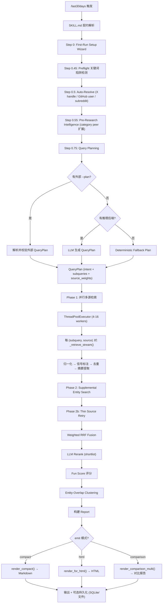

# last30days-skill 深度架构审计报告

> 审计时间: 2026-06-11 | 版本: v3.3.2 | Python 3.12+ | 零运行时依赖

---

## 1. 项目定位与核心价值

### 一句话定义
跨 15+ 社交/新闻/市场平台（Reddit、X、YouTube、TikTok、HackerNews、Polymarket 等）的 AI Agent 研究技能——将"过去 30 天内关于某话题发生了什么"这一开放问题，转化为结构化、聚类优先、多源融合的研究简报。

### 解决的痛点
在 AI Agent 技能生态中，**单一 LLM 的知识截止与 WebSearch 的浅层检索**之间存在巨大鸿沟：LLM 不知道最近发生了什么，WebSearch 只返回零散链接。last30days 填补的是**"深度时序研究"**这个空白——它不是搜索引擎，而是研究管线（Pipeline）：规划子查询 → 并行多源检索 → 归一化/去重/信号标注 → Reciprocal Rank Fusion → LLM Rerank → 聚类 → 渲染。任何 Agent Skills 兼容的宿主（Claude Code、Codex、Gemini CLI、Cursor 等 50+ 平台）均可通过 `/last30days <topic>` 触发。

### 核心技术栈
| 层级 | 技术 |
|------|------|
| Runtime | Python 3.12+（零 pip 运行时依赖，纯 stdlib urllib） |
| Agent 协议 | Agent Skills 开放格式（SKILL.md + scripts/），`npx skills add` 安装 |
| 推理后端 | Gemini / OpenAI / xAI / OpenRouter（通过 `ReasoningClient` 抽象） |
| 检索源 | Reddit（OAuth/keyless/RSS/shreddit 四路径）、X（bird-search/xAI/xurl 三后端）、YouTube（yt-dlp/ScrapeCreators）、TikTok/IG（ScrapeCreators）、HackerNews（Algolia）、Bluesky、Polymarket、GitHub、Digg 等 15+ 源 |
| 融合算法 | Weighted Reciprocal Rank Fusion（Cormack 2009, K=60） |
| 聚类 | Entity-overlap + MMR representative selection |
| 渲染 | Compact Markdown / HTML / Comparison 三模式 |
| 测试 | pytest 88 文件，uv 管理 venv |

---

## 2. 架构拓扑与数据流向

### 核心模块解耦

| 模块 | 职责 | 内聚关系 |
|------|------|----------|
| `SKILL.md` | Agent 技能契约——宿主 LLM 读取的运行时规范（8 条 LAW、步骤流程、输出合同） | 入口层，驱动 `last30days.py` |
| `last30days.py` | CLI 编排器——参数解析、preflight、auto-resolve、管线调用、competitor fanout、emit/save | 顶层调度，依赖 `pipeline`、`env`、`render` |
| `lib/pipeline.py` | 核心管线——`run()` 函数实现完整检索→融合→重排→聚类→报告流程 | 中枢，协调所有源模块 + `planner`/`fusion`/`rerank`/`cluster` |
| `lib/planner.py` | LLM-first 查询规划——意图识别、子查询生成、源分配、deterministic fallback | 被 `pipeline.run()` 调用，产出 `QueryPlan` |
| `lib/schema.py` | 数据模型——`SourceItem`→`Candidate`→`Cluster`→`Report` 的完整类型拓扑 | 被所有模块共享，零业务逻辑 |
| `lib/fusion.py` | Weighted RRF——多流融合、URL 归一化去重、per-author cap、源多样性保障 | 消费 `RetrievalBundle`，产出 `Candidate[]` |
| `lib/rerank.py` | LLM Rerank——短名单评分、entity-miss 惩罚、intent-specific 引导、untrusted-content 沙箱 | 消费 `Candidate[]`，原地修改 `final_score` |
| `lib/cluster.py` | 聚类——entity-overlap 分组、MMR 代表选择、uncertainty 标注 | 消费 `Candidate[]`，产出 `Cluster[]` |
| `lib/render.py` | 渲染——compact/HTML/comparison 三模式，badge、footer、safety lines | 消费 `Report`，产出字符串 |
| `lib/env.py` | 环境与凭证——`.env` 加载、Keychain、浏览器 cookie 提取、源可用性探测 | 基础设施层，被 `pipeline`/源模块广泛依赖 |
| `lib/providers.py` | 推理后端——`ReasoningClient` 抽象 + Gemini/OpenAI/xAI/OpenRouter 实现 | 被 `planner`/`rerank` 使用 |
| `lib/normalize.py` | 归一化——按源类型将原始 API 响应映射为 `SourceItem` | 被 `pipeline._normalize_score_dedupe()` 调用 |
| `lib/signals.py` | 信号标注——local_relevance / freshness / engagement / source_quality 四维评分 | 被 `pipeline` 在归一化后调用 |
| 源模块 (`reddit.py`, `bird_x.py`, `youtube_yt.py` 等 ×15) | 各平台检索 + 解析 + 富化 | 被 `pipeline._retrieve_stream()` 按名分发调用 |

### 业务时序/流程图



---

## 3. 协议边界与防腐设计

### Tool Schema 拓扑

该项目**不是 MCP Tool**，而是 **Agent Skill**——它的"Schema"不是 JSON Schema tool definition，而是 SKILL.md 这个 prose contract。宿主 LLM 读取 SKILL.md 后，按照其中的步骤自行编排调用。

**核心 Input（SKILL.md → Engine 的桥梁）：**

```json
{
  "topic": "string — 用户研究话题",
  "--plan": "JSON QueryPlan — 宿主 LLM 生成的查询计划（LAW 7 强制要求）",
  "--search": "comma-separated sources — 限定检索源",
  "--depth": "quick | default | deep",
  "--emit": "compact | html | comparison",
  "--x-handle": "X 用户 handle（pre-research 解析）",
  "--github-user": "GitHub 用户名",
  "--subreddits": "comma-separated subreddit 列表",
  "--lookback-days": "int (默认 30)"
}
```

**核心 Output（Engine → 宿主 LLM 的桥梁）：**

```json
{
  "Report": {
    "topic": "string",
    "range_from": "ISO date",
    "range_to": "ISO date",
    "query_plan": "QueryPlan",
    "clusters": [{"cluster_id": "str", "title": "str", "candidate_ids": ["str"], "representative_ids": ["str"], "sources": ["str"], "score": "float", "uncertainty": "single-source | thin-evidence | null"}],
    "ranked_candidates": [{"candidate_id": "str", "title": "str", "url": "str", "final_score": "float", "source": "str", "fun_score": "float | null"}],
    "items_by_source": {"source_name": ["SourceItem"]},
    "errors_by_source": {"source_name": "error message"},
    "warnings": ["str"]
  }
}
```

**SKILL.md 如何引导 LLM：**
- 8 条 LAW 构成非协商的输出合同（禁止 `Sources:` 块、禁止 em-dash、禁止 `##` 标题、强制 inline citation 等）
- Step 0.75 的 JSON plan schema 明确了 `QueryPlan` 的结构，宿主 LLM 必须按此生成
- Pre-Present Self-Check（7 点验证）作为最终防线

### 边界异常与防御性矩阵

| 威胁类型 | 防御机制 | 代码位置 |
|----------|----------|----------|
| **LLM 幻觉输入（关键词陷阱）** | `preflight.check_class_1_trap()` — 4 类关键词陷阱检测（PII、harmful、CSAM、doxxing），拒绝执行 | `lib/preflight.py:119` |
| **LLM 规划失败** | `planner.plan_query()` — LLM 规划异常时自动降级为 deterministic fallback plan | `lib/planner.py:118-124` |
| **LLM Rerank 失败** | `rerank.rerank_candidates()` — LLM 评分异常时使用 `_apply_fallback_scores()`（entity-miss 惩罚 + 本地信号） | `lib/rerank.py:94-97` |
| **LLM 输出注入** | `_fenced_untrusted_content()` — 将候选内容包裹在 `<untrusted_content>` 标签中，附带 SECURITY 声明禁止 LLM 遵循其中的指令 | `lib/rerank.py:71-75, 122-130` |
| **429 Rate Limit** | `rate_limited_sources` 线程安全集合 — 一旦某源 429，同源所有待执行 future 跳过 | `lib/pipeline.py:322-323, 378-381` |
| **5xx 瞬态错误** | `_is_transient_error()` 检测 + 单次重试（3s 退避） | `lib/pipeline.py:383-402` |
| **Reddit 403** | 四路径降级链：OAuth → keyless RSS → shreddit scrape → public JSON | 多个 reddit 模块 |
| **ScrapeCreators 402** | 付费配额耗尽时自动 fallback 到免费路径 | `lib/tiktok.py`, `lib/instagram.py` |
| **源不可用** | `available_sources()` 动态探测 — 按凭证/工具可用性决定启用哪些源 | `lib/pipeline.py:100-138` |
| **LAW 7 违反（宿主未传 --plan）** | stderr 警告："YOU ARE the planner" — 反向提示宿主 LLM 意识到自己应该生成 plan | `lib/planner.py:134-144` |
| **Entity Miss（Hermes 事故）** | `_primary_entity()` + `ENTITY_MISS_PENALTY=25` — 未提及主题实体的候选被惩罚性降分 | `lib/rerank.py:12-17, 152-160` |
| **Intent Modifier Echo（Hermes 事故）** | `_INTENT_MODIFIER_RE` 在规划/重排前剥离 "use cases"/"workflow" 等修饰词，防止搜索查询变成精确短语 | `lib/rerank.py:24-33`, `lib/planner.py:194` |
| **Per-author 垄断** | `_apply_per_author_cap(max=3)` — 单作者最多 3 条结果 | `lib/fusion.py:54-71` |
| **源过度集中** | `_diversify_pool(min_per_source=2)` — 保障低频源至少 2 条存活 | `lib/fusion.py:74-107` |
| **输出自检** | Pre-Present Self-Check 7 点验证 — 渲染前最终防线 | SKILL.md lines 1537-1549 |

**反向提示机制：** LAW 7 是该项目最独特的防腐设计——当宿主 LLM 未传 `--plan` 时，引擎通过 stderr 向 LLM 发出"你就是规划者"的元提示，引导 LLM 自我修正行为。这是**双向防腐**：不仅防御 LLM 的坏输入，还主动教育 LLM 正确使用技能。

---

## 4. 关键代码、上下文与运行时抽象

### 核心源码剖析

#### 1. `lib/pipeline.py:run()` — 管线中枢（~500 行核心逻辑）

**精妙之处：**
- **三阶段检索**：Phase 1（主查询并行）→ Phase 2（实体补充搜索）→ Phase 2b（薄弱源重试），形成渐进式检索策略
- **线程安全 429 传播**：`rate_limited_sources` + `rate_limit_lock` 使得一个线程检测到 429 后，同源所有待执行 future 立即跳过，避免无意义的 API 调用
- **GitHub 双模式**：project-mode（指定 repo 列表）和 person-mode（指定用户）在主循环前执行，主循环中跳过 GitHub 关键词搜索，避免冗余

#### 2. `lib/planner.py:plan_query()` — LLM-first 规划 + Deterministic 守卫

**精妙之处：**
- **三层降级**：外部 `--plan` → LLM 生成 → deterministic fallback，每层都有 `_sanitize_plan()` 校验
- **Intent Modifier 剥离**：2026-04-19 Hermes 事故的直接产物——当话题包含 "use cases"/"workflow" 等修饰词时，搜索查询剥离该短语，仅在 ranking_query 中保留语义，防止零结果
- **LAW 7 元提示**：stderr 输出"YOU ARE the planner"引导宿主 LLM 自觉承担规划责任

#### 3. `lib/fusion.py:weighted_rrf()` — 多流融合引擎

**精妙之处：**
- **标准 RRF（Cormack 2009, K=60）**：数学上严谨的排名融合，避免分数尺度不一致问题
- **Provenance 追踪**：每个 Candidate 的 metadata 中记录完整的来源证明链（source + subquery_label + native_rank + item_id），支持可解释性
- **三重多样性保障**：per-author cap → source diversity reservation → pool_limit truncation

### 状态与生命周期

**无状态设计。** 每次调用 `pipeline.run()` 创建全新的 `RetrievalBundle`、`QueryPlan`、`Report` 对象，调用结束后所有中间状态随函数栈销毁。

**例外——跨调用持久化：**
- `last-run.json`：记录最近一次运行的 topic/timestamp/source counts（用于 UI 展示）
- SQLite store（`--store` 标志）：可选的时序存储，用于 watchlist/briefing 场景
- Bluesky session cache（`_reset_session_cache()`）：进程内会话复用，避免重复认证

### 解耦与可插拔性

**源模块解耦模式：** 每个源是一个独立 `.py` 文件，实现 `search_*()` + `parse_*_response()` + 可选的 `enrich_*()` / `expand_*_queries()` 函数。`pipeline._retrieve_stream()` 通过 `if source == "reddit": reddit.search_and_enrich(...)` 的分发模式调用——**无注册表、无基类、无插件协议**，而是约定式分发。

**推理后端解耦：** `providers.ReasoningClient` 抽象基类定义 `generate_text()` / `generate_json()` 接口，Gemini/OpenAI/xAI/OpenRouter 四实现。`resolve_runtime()` 根据凭证可用性自动选择后端。

**渲染解耦：** `render_compact()` / `render_for_html()` / `render_comparison_multi()` 三函数接收 `Report` 对象，互不依赖。

---

## 5. 项目亮点与局限性评估

### 优秀工程实践

1. **零运行时依赖**：整个 21,000+ 行 Python 代码仅依赖 stdlib（v3.3.0 移除了 `requests`，改用 `lib/http.py` 封装 urllib），极大降低安装摩擦
2. **四层降级链（Reddit）**：OAuth → keyless RSS → shreddit HTML scrape → public JSON，确保无凭证用户也能获得结果
3. **双向防腐（LAW 7）**：不仅防御 LLM 坏输入，还通过 stderr 元提示主动教育宿主 LLM 正确使用技能——这在 Agent Skills 生态中是独创的
4. **Provenance 追踪**：每个融合候选携带完整来源证明链，支持可解释性和调试
5. **事故驱动设计**：多处代码注释引用具体事故（"2026-04-19 Hermes Agent Use Cases failure"），将生产教训直接编码为防御逻辑
6. **Untrusted Content 沙箱**：rerank prompt 中将候选内容包裹在 `<untrusted_content>` 标签中，防止 LLM 被互联网抓取内容注入
7. **`__init__.py` 裸标记**：严格遵守 AGENTS.md 规则，避免 eager import 导致的循环依赖和启动开销
8. **88 个测试文件**：覆盖率广泛，包括 adversarial、regression、integration 多层次

### 潜在风险与技术债

1. **源分发硬编码**：`pipeline._retrieve_stream()` 使用 `if source == "reddit": ... elif source == "x": ...` 链式分发，新增源需修改 pipeline.py——无注册表/插件机制，扩展性受限
2. **render.py 1779 行**：单文件 70KB，承担 compact/HTML/comparison 三模式 + 所有辅助函数，职责过重，违反 SRP
3. **pipeline.py 1138 行**：核心管线函数 `run()` 本身约 300 行，包含检索/融合/重排/聚类/报告构建全流程，认知负载高
4. **无类型化源协议**：源模块之间无共享基类或 Protocol，`search_and_enrich()` 的签名各不相同（参数名、返回类型），靠约定而非约束
5. **并发模型原始**：`ThreadPoolExecutor` + 手动 `rate_limit_lock`，无异步/协程，IO-bound 场景下线程开销非最优
6. **凭证安全面**：浏览器 cookie 提取（Chrome/Brave/Safari/Firefox）直接读取本地 cookie 数据库并解密，虽功能强大但扩大了攻击面
7. **bird-search vendor 锁定**：X 搜索的 bird-search 是 vendored Node.js 包，版本更新需手动同步
8. **SKILL.md 1710 行**：作为 LLM 上下文消耗巨大——宿主 LLM 每次调用需将整个 SKILL.md 加载到上下文窗口，token 开销显著

---

## 6. 快速上手与魔改指南

### 关键配置项

| 配置 | 位置 | 说明 |
|------|------|------|
| `.claude/last30days.env` 或 `~/.config/last30days/.env` | 项目级 / 全局 | 主配置文件，存放 API Key |
| `SCRAPECREATORS_API_KEY` | env | TikTok / Instagram / Pinterest 检索（付费 API） |
| `BRAVE_API_KEY` / `EXA_API_KEY` / `SERPER_API_KEY` | env | Web 搜索后端（优先级：Brave > Exa > Serper） |
| `GITHUB_TOKEN` | env | GitHub 检索 + star 富化 |
| `XAI_API_KEY` | env | xAI Grok 搜索（X 平台三后端之一） |
| `AUTH_TOKEN` + `CT0` | env | X 平台 Bird CLI 认证 cookie |
| `BSKY_APP_PASSWORD` | env | Bluesky 搜索 |
| `GEMINI_API_KEY` / `OPENAI_API_KEY` / `OPENROUTER_API_KEY` | env | 推理后端（规划 + 重排），优先级：Gemini > OpenAI > xAI > OpenRouter |
| `LAST30DAYS_MEMORY_DIR` | env | 输出持久化目录，默认 `~/Documents/Last30Days/` |
| `EXCLUDE_SOURCES` | env | 排除特定源（逗号分隔） |
| `INCLUDE_SOURCES` | env | 选择性启用 opt-in 源（如 perplexity, pinterest） |

**最小可运行配置：** 零 API Key 即可运行——Reddit keyless 路径 + HackerNews + Polymarket 始终可用，deterministic fallback planner 无需推理后端。

### 二次开发切入点——新增检索源

以新增一个名为 `mastodon` 的源为例：

**Step 1：创建源模块** — 仿照 `lib/bluesky.py`（最简洁的社交源模板）

```python
# skills/last30days/scripts/lib/mastodon.py
def search_mastodon(query, from_date, to_date, *, config, depth, **kwargs):
    """检索 Mastodon 实例的公开帖子。"""
    # 1. 调用 Mastodon API（使用 lib/http.py）
    # 2. 返回 raw_items: list[dict]
    ...

def parse_mastodon_response(data):
    """将 API 响应解析为标准 dict 列表。"""
    ...
```

**Step 2：注册到管线** — 修改 `lib/pipeline.py`

1. 在顶部 `from . import` 块添加 `mastodon`
2. 在 `MOCK_AVAILABLE_SOURCES` 列表添加 `"mastodon"`
3. 在 `available_sources()` 函数中添加可用性探测逻辑
4. 在 `_retrieve_stream()` 函数的 `if source == "mastodon":` 分支添加调用

**Step 3：归一化** — 修改 `lib/normalize.py`

添加 `_normalize_mastodon()` 函数，将 Mastodon 原始字段映射为 `SourceItem` 所需格式。

**Step 4：信号标注** — 修改 `lib/signals.py`（可选）

如需 Mastodon 特有的 engagement 计算（boosts + favs），添加对应分支。

**Step 5：渲染** — 修改 `lib/render.py`

在 `SOURCE_LABELS` 字典添加 `"mastodon": "Mastodon"`。

**Step 6：环境与凭证** — 修改 `lib/env.py`

添加 `is_mastodon_available(config)` 和 `get_mastodon_token(config)` 函数。

**Step 7：SKILL.md 更新** — 在 Step 0.55 和 Research Execution 步骤中说明 Mastodon 的使用方式和所需凭证。

**Step 8：测试** — 仿照 `tests/test_bluesky.py` 创建 `tests/test_mastodon.py`。

**Step 9：配置文档** — 在 `CONFIGURATION.md` 的 API Key 表和 env var 节添加 `MASTODON_*` 条目。

---

*报告完毕。*
